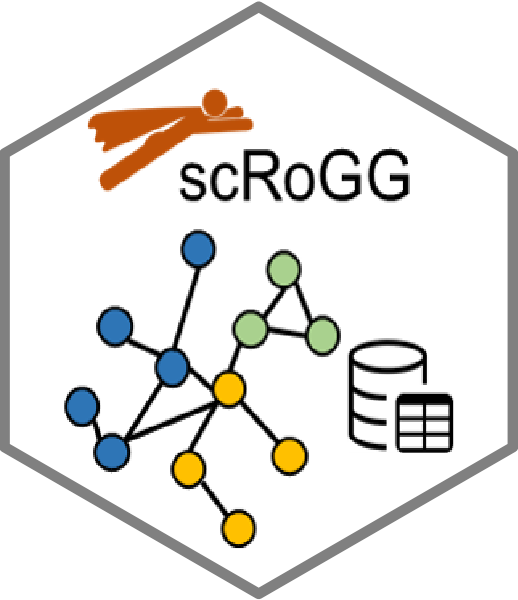

```{r setup, include=FALSE}
knitr::opts_chunk$set(echo = TRUE)
```

**Current package version: v0.0.9** {width="104"}

Coexpression networks are important for revealing functional relationships and interactions between genes. With the application of single-cell RNA-seq, it is now possible to investigate the network in a single cell type.

Here I demonstrate the application of **scRoGG** using the example data stored in the package (naive CD4+ T cells from a healthy human PBMC).

### `scRoGG`

```{r, scRoGG}
library(scRoGG)
naiveT <- readRDS(system.file("data", "naiveT.rds", package = "scRoGG")) # 711 cells with 13714 genes
naiveT_cor <- scRoGG(naiveT, normalised = T) # true normalised =T if your input data is unnormalised.
# about 5 minutes
```

It will return you a list of three component:

1.  `bi_zero`: a vector for the sparsity in a given gene pair.
2.  `prop_distribution`: a dataframe contains the correlation distribution for each gene pair.
3.  `transformed_data`(optional): a transformed dataframe mainly for visualising the coexpression in a given gene pair. See more in `plotCoExp`.

Next, scRoGG performs an asymptotic test for the coefficient of variation on the correlation distribution against the null distribution. For the likelihood-ratio test, only the upper tail (more strength) gene pairs would be return.

### `robustness`

```{r, robustness}
naiveT_cor_sig <- robustness(naiveT_cor)

# to reduce the computational burden, you can still skip the test and focus on the top 0.1% quantile gene pairs (by set stats=F).

#naiveT_cor_sig1 <- robustness(naiveT_cor,stats = F)
# about 7 minutes
```

A dataframe will be returned that contains 4 columns, which are:

-   gene1, gene2: gene symbols for the gene pair.

-   RS: robustness score that incorporates the sign calculated from Pearson correlation method.

-   p.adj: adjusted p-values from the asymptotic test that adjusted by BH method.

You may explore the top-ranked gene pairs through literature. One way to plot them is to use our in-built function.

### `plotCoExp`

```{r plot coexpressed}
plotCoExp(naiveT$transformed_data,'NKG7','CCL5')+ggtitle('Naive CD4+ T')
# ggplot2 objects 
```

Here scRoGG introduces an alternative way to construct coexpression networks.The input data requires an edgelist dataframe (gene1, gene2, value), which can be generated by any methods

### `coExp_network`

```{r coexpression network}
# Here I only plot the first largest sub-communities
# We used Leiden clustering method, for more information, please refere to our manuscript.
naiveT_net <- coExp_network(naiveT_cor_sig[,1:3],n_networks = 1)

```

A list of [*`igraph`*](https://igraph.org/) objects will be returned.

-   'all': the full network based on all significant gene pairs.

-   'sub_1': the first largest sub-communities.

In addition, scRoGG also implements network-based gene-set enrichment analysis (net-GSEA). This method can be applied to any igraph objects, not limited to scRoGG. Geneset information uses the syntax from [msigdbr](https://cran.r-project.org/web/packages/msigdbr/vignettes/msigdbr-intro.html) package.

### `net_gsea`

```{r net_gsea}
# for example against GO bioligcal processes pathways
naiveT_gsea <- net_gsea(network = naiveT_net[['all']],species = 'Homo sapiens', category = 'C5',subcategory = 'GO:BP',minSize = 20)

# One possible way to visualise the significantly enriched pathway 
plotPways(naiveT_gsea,p.adj = 0.05)+ggtitle('Naive CD4+ T cells')

```

### Session info

```{r}
session_info()
```
